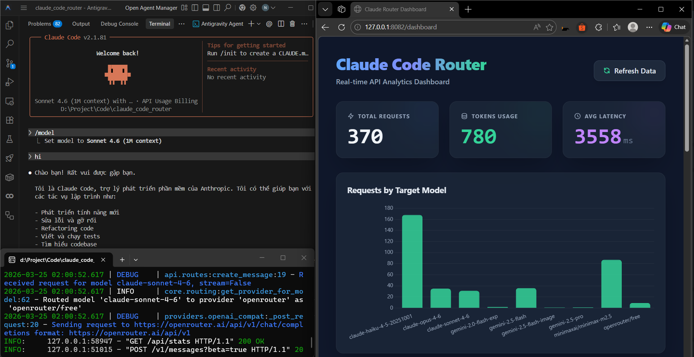

# 🚀 Claude Code API Router Server

<p align="center">
  
</p>

<p align="center">
  <a href="https://github.com/justHman/CLAUDE_CODE_ROUTER/stargazers"></a>
  <a href="https://github.com/justHman/CLAUDE_CODE_ROUTER/network/members"></a>
  <a href="https://github.com/justHman/CLAUDE_CODE_ROUTER/issues"></a>
  
</p>

<p align="center">
  <b>A powerful, hierarchical API proxy and router for Claude Code.</b><br>
  Route requests to Gemini, NVIDIA, OpenRouter, and more with seamless format translation and granular parameter control.
</p>

---

## 📖 Table of Contents
- [✨ Key Features](#-key-features)
- [🛠️ Tech Stack](#️-tech-stack)
- [📂 Project Structure](#-project-structure)
- [🚀 Quick Start](#-quick-start)
- [⚙️ Configuration (4-Level Inheritance)](#️-configuration-4-level-inheritance)
- [🔗 Claude Code Integration](#-claude-code-integration)
- [🤝 Contributing](#-contributing)
- [☕ Support](#-support)
- [🔧 Troubleshooting](#-troubleshooting)
- [📜 License](#-license)

---

## ✨ Key Features

- **🎯 Intelligent Routing**: Map any Claude model to any provider (Gemini, NVIDIA, OpenRouter, etc.).
- **🏗️ 4-Level Inheritance**: Granular configuration merging from Global ➔ Provider ➔ Profile ➔ Model.
- **🎭 Contextual Profiles**: Predefined strategies like `coding` (Temp 0), `creative`, and `balanced`.
- **💉 System Prompt Injection**: Automatic prefix/suffix injection for persona control.
- **📊 Analytics Dashboard**: Built-in SQLite-backed UI to monitor tokens, latency, and costs.
- **🖼️ Multimodal Support**: Full support for Text, Vision (Images), and Tool Calling.

---

## 🛠️ Tech Stack

- **Core**:   
- **Providers**:  
- **Monitoring**:  

---

## 📂 Project Structure

```text
.
├── api/             # API Endpoints & Request Handling
├── config/          # YAML configs & .env templates
├── core/            # Configuration, Routing & Database logic
├── providers/       # Gemini, NVIDIA, OpenRouter implementations
├── templates/       # Dashboard HTML frontend
├── tests/           # Comprehensive Test Suite
├── transformers/    # Format Mappers (Anthropic ↔ OpenAI)
├── utils/           # Helper scripts (Model discovery)
├── demo.png         # Project Preview image
├── main.py          # API Server Entry Point
└── run.py           # Claude Code CLI Integration Wrapper
```

---

## 🚀 Quick Start

1. **Clone & Setup**:
   ```powershell
   git clone https://github.com/justHman/CLAUDE_CODE_ROUTER.git
   cd CLAUDE_CODE_ROUTER
   python -m venv venv
   .\venv\Scripts\activate
   pip install -r requirements.txt
   ```

2. **Configure Environment**:
   Update `config/.env` with your provider API keys.

3. **Launch Server**:
   ```powershell
   python main.py
   ```

---

## ⚙️ Configuration (4-Level Inheritance)

The router employs a sophisticated merging strategy to resolve parameters like `temperature`, `max_tokens`, `top_p`, `top_k`, and `system_prompt`:

1.  **Level 1: Global Configuration** (`global_config`): The baseline defaults for all requests.
2.  **Level 2: Provider Defaults** (`providers[name].config`): Overrides Global for specific providers (e.g., Gemini).
3.  **Level 3: Contextual Profile** (`profiles[name]`): Reusable parameter sets (e.g., `coding`) assigned to a model.
4.  **Level 4: Model Specific** (`model_mapping[name].config`): **Highest Priority**. Overrides everything for a specific model alias.

---

## 🔗 Claude Code Integration

To route Claude Code through your server, update your `~/.claude/settings.json`:

```json
{
  "env": {
    "ANTHROPIC_BASE_URL": "http://127.0.0.1:8082",
    "ANTHROPIC_AUTH_TOKEN": "",
    "ANTHROPIC_API_KEY": "",
    "ANTHROPIC_MODEL": ""
  },
  "model": ""
}
```

---

## 🤝 Contributing

We welcome contributions from everyone!

- 🌟 [Star the repo](https://github.com/justHman/CLAUDE_CODE_ROUTER) if you find it useful.
- 🍴 [Fork the project](https://github.com/justHman/CLAUDE_CODE_ROUTER/fork) to start your own features.
- 🐛 [Report Bugs](https://github.com/justHman/CLAUDE_CODE_ROUTER/issues) or suggest improvements.
- 🧑‍💻 [View Profile](https://github.com/justHman) of the project lead.

---

## ☕ Support

If this project helps you, consider supporting the development!

<p align="center">
  <a href="https://drive.google.com/file/d/1gtKSu8iBc99grcnIH2CPifA929sTtI5U/view?usp=sharing">
    
  </a>
</p>

---

## 🔧 Troubleshooting

<details>
<summary><b>Model Alias Not Found</b></summary>
Ensure the model name in your `settings.json` exactly matches a key in `config.yaml`'s `model_mapping`.
</details>

<details>
<summary><b>Gemini 429 Errors</b></summary>
The Gemini Free tier has strict per-minute limits. Check your Google AI Studio console for quota details.
</details>

---

## 📜 License

Distributed under the **MIT License**. See `LICENSE` for more information.

---

<p align="center">
  Made with ❤️ by <a href="https://github.com/justHman"><b>Hman</b></a>
</p>

<p align="center">
  <a href="https://github.com/justHman/CLAUDE_CODE_ROUTER">⭐ Github</a> | <a href="https://github.com/justHman/CLAUDE_CODE_ROUTER/pulls">🧪 PRs</a> | <a href="https://github.com/justHman/CLAUDE_CODE_ROUTER/issues">🐛 Issues</a>
</p>
